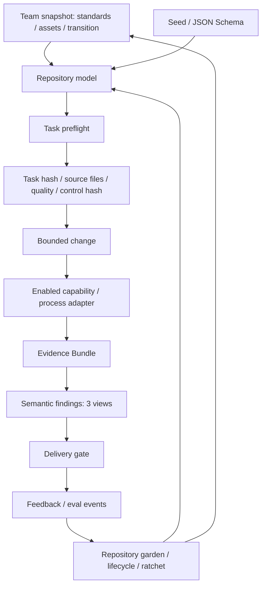

# Harness Platform design

Author: Harness Starter Kit maintainers。Date: 2026-09-13。Status: implemented v1。
対象読者: Coding Agent、導入担当者、CLI/adapterの開発者。

このPlatformはfeature単位の成功とチーム資産の成長を同じcontrol planeに接続する。
CLIが機械判定、Skillsがorchestrationとsemantic reasoningを担当する。
初期化は仕組みを配布し、プロジェクト固有の正解をUNKNOWNとして残す。

## Scope and success criteria

27 interface、3 loop、14必須CLI command、11 Skills、schema、fixtureとmutation testを配布する。
有効なfixtureのdeliveryがexit 0、欠損・失敗・改変・scope逸脱が非0となることを成功条件とする。
ドメインの正解・SLOの値・実行sandbox・共有サービスの認証・production deploymentは導入先が提供する。

## Planes and packages

`src/harnessctl`はCLI、`resources/seed`は導入データ、`resources/skills`はSkillsの正本。
wheelおよびPyInstallerバイナリへ同梱し、runtimeとusageのversionずれを避ける。導入先の`.harness/schemas`はCLI同梱版とdoctorで照合する。
JSON Schema Draft 2020-12を使用し、追加field・未知version・不正な参照pathを拒否する。
`.harness/project.json`、interfaces、capabilities、policy、assets、quality、evolution、knowledgeがcontrol plane。
Task、baseline、feedback、eval、lifecycleは個別の履歴レコード。`.harness/runs`はsource snapshotから除外する生成証拠。

## Task Loop

Task ContractにはAC→capability、risk理由、scope、asset analysis、placement、consumer impactを必須化する。
preflightは該当interfaceのreadiness、UNKNOWN、既存asset検索候補、重複判断、target方向、global qualityを検査する。
成功時にTask digest、source file map、quality、control digestをreceiptに保存する。
receiptの上書き再基準化は認めない。改訂Taskは新しいIDとし、元Taskとの関係を計画に記録する。

verifyは必要capabilityを集合として解決する。AC・Task・対象interface・全MUST ruleのcapabilityを実行する。
明示的にenabledなargvをshell展開せず実行する。timeoutはprocess groupを停止し、終了値、ログ、artifactを記録する。
artifactが前回から更新されなければfailed。実行中・実行後のsource変更はbundleを無効にする。

deliveryはpreflight条件をdeliveryのrisk閾値で再確認する。実際の追加・変更・削除をreceiptと比較しscopeを検査する。
新規pathはplacementにも一致する必要がある。active/planned migration sourceへの新規追加とforbidden pathへの変更を拒否する。
全scopeのquality低下・score削除、policy/capability/Taskなどのcontrol変更を拒否する。
ACごと、およびglobal-impactについてentailment・contradiction・counterexampleのfindingが必要。
unknown/fail・矛盾・unsupported assumption・古いsource digest・欠けた証拠はblockする。

## Repository Evolution Loop

knowledgeはowner、status、review時刻、content digest、local linkを検査する。
Brownfield baselineは既存finding fingerprint・readiness・qualityを保存する。新規findingを追加するbaseline更新は拒否する。
触ったinterfaceの欠損はbaselineで免除しない。schema改変やMUST enforcement欠損も免除しない。
Greenfield Taskは対象外interfaceのUNKNOWNを許容するが、doctorは全体の未定義状態を報告する。

qualityはscope×dimensionごとの0–100点と根拠・証拠path。点数の妥当性はsemantic review対象で、CLIは単調性と参照を検査する。
inventoryはcapability集合の重複候補を返す。同値性やdead codeは自動断定しない。
feedbackは根本原因・再発性・既存asset・介入理由を保存する。分類器は提案、promoteは実在成果物・decisionとの関連付け。
lifecycleはexperimental→standard→deprecated→removedのみ。全consumerの検証記録とreviewerを要求する。
物理ファイル削除はcleanup Taskが担当する。catalogだけのremovedは削除済みコードの証明ではない。

## Team Evolution Loop

チームのassets/policy/evolutionを1つのteam schema snapshotとしてvendorし、projectでcanonical JSON digestをpinする。
repository ruleはteam ruleへ追加され、ID衝突は拒否する。readinessは厳しい方、鮮度は短い方、review viewは和集合を適用する。
reviewerは全適用policyに登録されている必要がある。repository側のpolicyでteam invariantを弱められない。
shared catalogには任意のrepository/package URLをlocationとして保持できる。ローカルpathの実在は検査するが、remote URLは自動fetchしない。
team資産の変更はownerのsource repositoryへ提案し、変更後のsnapshotをレビューしてpinを更新する。
evalはtask観測イベントを集計し、asset miss、rework、介入、review disagreement等を改善対象の選択に使う。

## Trust and implementation limits

ローカルJSONはレビュー対象の信頼された設定。reviewer名は承認記録のfieldであり、本人認証ではない。
receipt・bundle・logのhashは偶発的な差し替えや古い証拠を検出する。署名がないため、悪意ある書き手による全レコードの再作成は防がない。
CIは保護された基準policy、制限された実行環境、信頼するcapability定義を用いること。
process adapterはsandboxではなく、登録された実行プログラム自身はホスト権限を持つ。
source snapshotはbuild/dist、cache、仮想環境、node_modules、Git metadata、runs/backupsを除外する。そこをproduct sourceの置き場にしない。
path patternはPython fnmatchで、`*`はslashにも一致する。`app/**`はapp配下を示し、`.`は全体なのでscopeに使う際はレビューする。

## Alternatives and trade-offs

| Option | Benefit | Cost / reason |
|---|---|---|
| Python + JSON Schema（採用） | CLI・subprocess・schemaを少ない依存で配布 | Python runtimeとjsonschemaが必要 |
| TypeScript CLI | JS利用者の導入が容易 | Node非利用環境にもNodeが必要 |
| 文書とSkillsのみ | 初期配布が単純 | 証拠・ratchet・scope検査をモデル判断へ依存させる |
| 言語別CLI | 各frameworkと密に統合 | interfaceの互換性維持と重複実装が増える |

## Validation and rollout

fixture上で正常系→単一mutation→blockを検証する。実プロジェクト導入はinspect、init、doctor、capability接続の順。
Brownfieldは最初のbaselineをレビューし、1つのvertical sliceから運用する。team snapshot連携はowner合意後に加える。
upgradeはdry-runで差分を確認し、conflictの解決後にapplyする。rollbackは[upgrade手順](upgrades.md)を参照。
