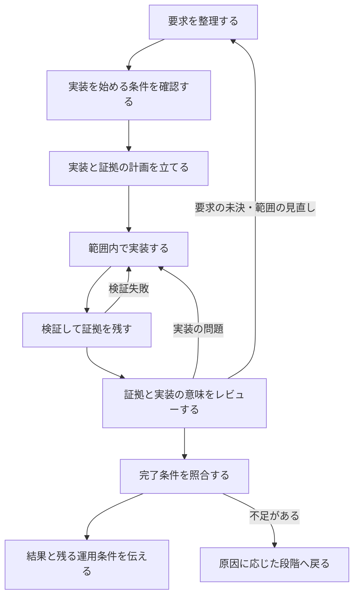
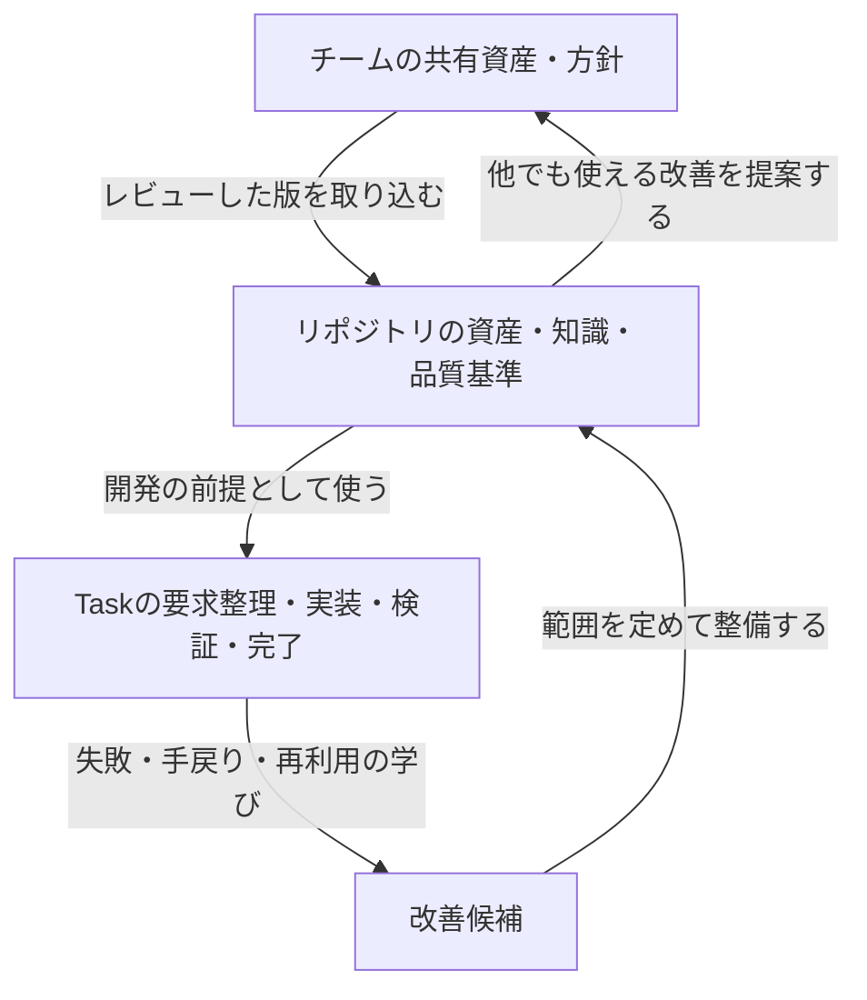

# Harnessが支える開発プロセス

Harnessは、**目的と変更範囲を共有し、その範囲で実装し、証拠に基づいて完了を判断し、得た学びを次の開発へ戻す**ためのツールです。CLIの`harnessctl`は、このプロセスの各節目で、進むための条件が揃っているかを検査します。

この文書は、Harnessを使ってCoding Agentと開発する利用者・チームに向けた概念ガイドです。共有したいのは、「今回何を実現するのか」「何を守るのか」「何が揃えば完了なのか」という判断の軸です。

## 1. 開発の単位は「目的・境界・証拠」を持つTask

Harnessでは、一つの変更をTaskとして扱います。Taskには、実現する結果、変更してよい範囲、受け入れ条件、その条件を確かめる方法を定めます。この合意を記録したものが**Task Contract**です。

たとえば「注文をキャンセルできるようにする」という依頼だけでは、出荷済み注文をどう扱うか、返金まで含めるか、どの動作を確認すれば完了かが決まりません。実装前に、利用者の意図と既存の業務ルールを照らし合わせ、これらを明らかにします。

| Taskで共有すること | 答える問い |
|---|---|
| 目的・受け入れ条件（AC） | 利用者にどのような結果を提供するか。何を観測すれば達成を確認できるか |
| 変更範囲・非目標 | 今回どこを変更し、何を扱わないか |
| 制約・リスク | 守る業務ルールや設計方針は何か。どの失敗を警戒するか |
| 既存資産・影響先 | 何を再利用できるか。変更によってどの利用側が影響を受けるか |
| 検証方法 | 各条件を、どの検証の結果とレビューで確認するか |

調べる範囲と変更する範囲は別に考えます。既存の共通部品、利用側、移行計画まで広く調べたうえで、実際の変更はTaskの境界に収めます。関連する改善を見つけても、その場で変更を広げず、別の作業として記録します。

## 2. 利用者・Agent・CLIが責任を分担する

| 担当 | 主な役割 |
|---|---|
| 利用者・チーム | 目的、業務上の正しさ、許容するリスク、権限、プロジェクトの方針を決める |
| Coding Agent | 既存の根拠を調べ、未決事項を整理し、Taskと計画を作り、実装・検証・レビューの記録を揃える |
| CLI | 契約や記録の整合性、必要な検証の実行、証拠の鮮度、変更範囲、完了条件を機械的に検査する |

AgentはSkillsに記載された手順を使って作業を進めます。利用者が日常的にすべての設定やJSONを書くことは想定していません。ただし、既存の仕様に根拠がない業務判断をAgentが推測で決めることも想定していません。

CLIによる検査には限界があります。たとえば「出荷済み注文をキャンセル不可にする」という条件に検証結果が紐づいていることは検査できます。その条件自体が事業にとって正しいか、検証が重要なケースを捉えているかは、利用者・チームとレビュー担当が判断します。

## 3. 一つのTaskを進める流れ

各段階は「次へ進むための問い」を持ちます。**Gate**は、その問いに答える条件が揃っているかを検査する節目です。

### 要求を整理する — 何を達成すればよいか

依頼をTask Contractへ整理します。既存資産を検索し、再利用・拡張・新設の理由を明確にします。新しく作る場合には、既存資産では目的を満たせない理由と配置先を示します。

未決事項は`UNKNOWN`として扱います。これは調査や意思決定が必要な箇所を示す記録です。今回のTaskに未解決の事項が残っていれば、実装前のGateを通せません。

### 実装を始める条件を確認する — このTaskを検証可能な形で進められるか

実装前の確認を**preflight**と呼びます。今回扱う領域の仕様や責任者、検証手段、既存資産の検討、設計方針との整合などを確認します。必要な準備水準は、設定された方針とTaskのリスクに従います。

通過すると、Taskと変更前の状態を記録した**receipt**が残ります。完了時にはこれを基準として実際の変更を照合します。途中で都合よく基準を取り直して、範囲外の変更を見えなくすることはできません。

### 計画を立てて実装する — どの変更で目的を満たし、どう確かめるか

実装する順序と、各受け入れ条件の証拠を得る方法を計画します。既存部品との接続、影響先の確認、対象となるテストまで見通したうえで、Taskの範囲内で実装します。

この流れは、実装とテストを小さく繰り返す進め方と併用できます。最後の検証までテストを待つ必要はありません。実装中の試行を経て、完了判定に使う証拠を変更後の状態で揃えます。

### 検証する — 今回の変更について、どの結果が得られたか

Harnessは、プロジェクトに登録された検証手段を**capability**として利用します。既存のテスト、型検査、ビルド、専門の検証ツールなどを接続し、Task・受け入れ条件・対象領域・必須ルールが要求する検証を実行します。

結果、ログ、生成物と対象の状態をまとめた記録が**Evidence Bundle**です。「テストを実行した」という報告を、どのTaskのどの状態について何が成功したかを追える証拠にします。

検証後にソースを変更すると、その証拠は古くなります。修正後の状態で再び検証し、レビューも更新します。

### レビューする — その証拠から、要求を満たしたと言えるか

検証の成功に加えて、要求・実装・証拠を読み合わせる**意味論レビュー（semantic review）**を行います。各受け入れ条件と全体への影響を、次の3視点で確認します。

| 視点 | 確認すること | 注文キャンセルの例 |
|---|---|---|
| entailment（裏付け） | 証拠から達成を説明できるか | 状態変更の結果から、未出荷注文のキャンセル成立を確認できるか |
| contradiction（矛盾） | 要求・既存ルール・実装・証拠が食い違っていないか | 出荷済み注文を変更しないというルールに反していないか |
| counterexample（反例） | 成功という結論を崩すケースがないか | 出荷処理とキャンセルが同時に起きた場合にも条件を守れるか |

全体への影響では、再利用の判断、重複、目標とするアーキテクチャ、利用側、品質評価の根拠も確認します。「全体」とは今回の変更が周囲に与える影響を含めて見ることであり、範囲外の改善まで実装することではありません。

3視点はレビューの観点です。CLIは記録の網羅性や証拠との紐付けを確認しますが、レビュー内容の真偽を証明するものではありません。

### 完了を判断する — 合意した条件が、現在の成果物について揃っているか

**delivery Gate**で、実装前の基準と現在の変更、検証の証拠、レビュー結果を照合します。範囲外の変更、必須検証の不足、古い証拠、未解決のレビューなどがあれば、完了には進めません。

利用者への完了報告では、何を変更したか、何を検証したか、残る運用条件を伝えます。deliveryの通過は、Harness上で受け渡し条件が揃ったことを示します。マージ・公開・本番デプロイは、プロジェクトの手順と利用者から与えられた権限に従って行います。

## 4. 問題が見つかったら、原因に合った段階へ戻る

このプロセスでは、発見に応じて要求や実装を見直します。Gateの失敗は、次に揃えるべき条件を示します。

| 見つかったこと | 次の行動 |
|---|---|
| キャンセルできる状態が未定義 | 既存仕様を調べ、根拠がなければ利用者へ業務判断を確認する |
| 必要な検証手段が接続されていない | 検証環境を整え、capabilityを登録・確認する。設定変更はfeatureと分けてレビューする |
| 実装がテストやレビューを通らない | 原因を修正し、現在の状態で証拠とレビューを更新する |
| 目的の達成にTask範囲外の変更が必要 | 要求と範囲を見直す。preflight後の契約改訂は新しいTask IDにし、元Taskとの関係を計画に残す |
| 無関係な重複や古い文書を発見した | 別の改善作業へ記録し、今回の変更を広げない |

失敗を説明文だけで成功へ読み替えたり、機能を通すために品質基準を緩めたりしません。方針・品質の基準・検証手段そのものを変える場合は、変更の理由と影響をfeatureとは分けてレビューします。

## 5. 開発を繰り返すほど、次のTaskの前提を良くする

Harnessは、Taskを完了させる流れに加えて、リポジトリとチームを改善する流れを持ちます。

**Task Loop**は、一つの目的を達成して証拠とともに受け渡す循環です。

**Repository Evolution Loop**は、開発で見つかった問題を、同じリポジトリの知識・資産・品質へ反映する循環です。たとえば、繰り返し確認された業務ルールを文書へ戻す、見落とされた共通部品を資産一覧で見つけやすくする、重複の整理を別Taskとして進める、といった改善を行います。既存の仕組みを調べ、再発原因に合う改善先を選びます。

**Team Evolution Loop**は、複数のリポジトリに役立つ資産や方針を共有する循環です。共有元のownerへ改善を提案し、利用側への影響をレビューします。各リポジトリは採用する共有情報の版を固定して取り込み、更新もレビューして行います。

この仕組みには、契約・証拠・資産情報を維持する手間がかかります。その代わり、担当者やAgentが変わっても、判断の前提と完了の根拠を引き継げます。学びを既存の文書や検証へ戻すことで、同じ未決事項や失敗を次のTaskへ持ち越すことを減らします。

## 6. 既存プロジェクトでは、現在地から段階的に始める

導入時には、そのプロジェクトの業務ルールや設計上の正解を設定する必要があります。初期生成された`UNKNOWN`や空の検証設定は、これから埋めるべき前提を示します。

既存プロジェクトでは、確認した既存の不足を**baseline**として記録し、最初に変更する領域から準備を整えます。baselineは、既存の不足と今回増えた問題を区別するための基準です。今回触る領域の不足や、新しく生じた問題を免除するものではありません。

たとえば、注文キャンセルを最初のTaskにするなら、そこで必要になる業務ルール・影響先・検証手段を明らかにします。リポジトリ全体の課題は追跡しながら、変更する領域は要求される準備水準を満たして進めます。

## 7. 利用者が共有しておく三つの問い

依頼時には、**「今回、何ができれば目的を達成したと言えるか」**を伝えます。避けたい結果や変更してほしくない範囲も、Taskの境界になります。

進行中には、**「未決事項や新しい発見によって、合意を見直す必要があるか」**を確認します。Agentが既存の根拠から解決できることは調査で進め、業務上の選択が残る場合は利用者が判断します。

受け取り時には、**「この成果物について、条件を満たす証拠とレビューが揃っているか」**を確認します。変更内容・検証結果・残る運用条件を理解したうえで、次の作業や公開へ進みます。

具体的な導入と依頼方法は[利用開始ガイド](getting-started.md)、運用上の構造は[Operating model](operating-model.md)、検証の責任分担は[検証の3分類と接続契約](verification.md)を参照してください。
