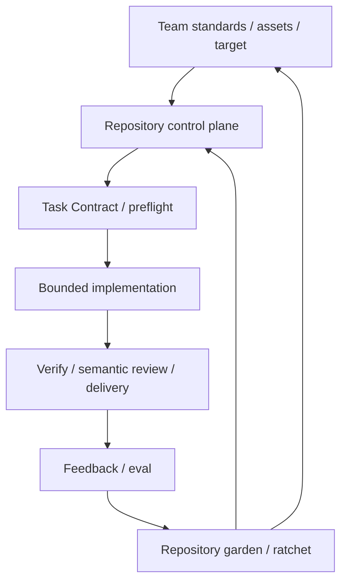

# Operating model

対象はCoding AgentとCIの運用者。Control planeのJSONは`.harness/schemas/`の契約に従う。

Task Loop: intake → preflight → plan → implement → verify → review → delivery。
Repository Evolution Loop: knowledge check / quality / inventory duplicates → bounded cleanup → feedback / baseline ratchet。
Team Evolution Loop: pinしたshared catalogとpolicyを検索 → consumer impact → reviewed promotion / lifecycle → team snapshot更新。

初期seedはUNKNOWNを残す。空のregistryは利用準備完了を意味しない。
Brownfieldではbaselineに記録された既存欠損のみを許容し、触るinterfaceは要求readinessを満たす。
Semantic findingは根拠・反例・結論を監査するための形式であり、CLIは意味論の正しさを証明しない。

CLIは常にJSON、exit 0=pass、1=gate blocker、2=invalid input。`--root`はsubcommandの前に置く。
プロセス実行はregistryのenabledなargvのみ。実行sandboxや認証基盤はホスト/CI側が提供する。
